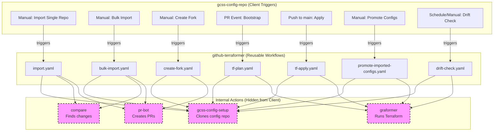

# GitHub Actions Workflows Guide

This guide documents the reusable GitHub Actions workflows provided by github-terraformer and how they're used by gcss-config-repo.

## Architecture Overview



### Two-Repository System

- **gcss-config-repo**: Triggers workflows (what users interact with)
- **github-terraformer**: Provides reusable workflows and internal actions (implementation details)

## Reusable Workflows (github-terraformer)

### 1. 📥 `import.yaml` - Single Repository Import

**Purpose**: Import a single GitHub repository configuration

**Inputs**:

- `repo_name` (string): Repository to import (without org prefix)
- `gcss_ref` (string): Branch of github-terraformer to use

**Process**:

1. Generate GitHub App token
2. Clone gcss-config-repo via gcss-config-setup action
3. Run importer: `just import-repo {org}/{repo_name}`
4. Compare action identifies new/changed files
5. Create PR with changes in `importer_tmp_dir/`

**Called by**: gcss-config-repo's import workflow

---

### 2. 📦 `bulk-import.yaml` - Bulk Repository Import

**Purpose**: Import multiple repositories based on import-config.yaml

**Inputs**:

- `gcss_ref` (string): Branch of github-terraformer to use

**Process**:
1. Uses import-config.yaml to determine which repos to import
2. Runs `just import-repos` to import all configured repositories
3. Creates single PR with all changes

**Called by**: gcss-config-repo's bulk-import workflow

---

### 3. 🍴 `create-fork.yaml` - Fork and Import

**Purpose**: Fork an external repository and import its configuration

**Inputs**:

- `upstream_repo` (string): Repository to fork (format: `owner/repo`)
- `new_repo_name` (string, optional): Name for the fork
- `gcss_ref` (string): Branch of github-terraformer to use

**Process**:

1. Fork the upstream repository
2. Import the forked repository configuration
3. Create PR with the new configuration

**Called by**: gcss-config-repo's create-fork workflow

---

### 4. 📋 `tf-plan.yaml` - Terraform Plan

**Purpose**: Run Terraform plan on pull requests

**Inputs**:

- `commit_sha` (string): Git SHA to checkout
- `gcss_ref` (string): Branch of github-terraformer to use
- `tfc_org` (string): Terraform Cloud organization

**Process**:

1. Setup configuration from commit SHA
2. Initialize Terraform with HCP backend
3. Run `terraform plan` via graformer action
4. Post plan results to PR as comment

**Called by**: gcss-config-repo on PR events

---

### 5. ✅ `tf-apply.yaml` - Terraform Apply

**Purpose**: Apply Terraform changes when PRs are merged to main

**Inputs**:

- `commit_sha` (string): Git SHA to apply
- `gcss_ref` (string): Branch of github-terraformer to use
- `tfc_org` (string): Terraform Cloud organization

**Process**:

1. Setup configuration from commit SHA
2. Run `terraform apply -auto-approve`
3. Changes are applied to GitHub repositories

**Called by**: gcss-config-repo on push to main

---

### 6. 🎯 `promote-imported-configs.yaml` - Promote Configurations

**Purpose**: Move imported configurations from `importer_tmp_dir/` to `repos/`

**Inputs**:

- `commit_sha` (string): Commit with configs to promote
- `pr_number` (string): PR number for reference
- `tfc_org` (string): Terraform Cloud organization

**Process**:

1. Run Terraform apply to import resources
2. Sanitize YAML files (remove IDs via yq)
3. Move files from `importer_tmp_dir/` to `repos/`
4. Commit and push changes

**Called by**: Manual trigger after import PR is merged

---

### 7. 🔍 `drift-check.yaml` - Configuration Drift Detection

**Purpose**: Detect drift between Terraform state and actual GitHub configuration

**Inputs**:

- `commit_sha` (string): Commit to check
- `gcss_ref` (string): Branch of github-terraformer to use
- `tfc_org` (string): Terraform Cloud organization

**Process**:

1. Run `terraform plan -detailed-exitcode`
2. Report any detected drift
3. Can be scheduled or manually triggered

**Called by**: gcss-config-repo (scheduled or manual)

## Custom Actions (github-terraformer)

### `gcss-config-setup`

Clones gcss-config-repo and copies configuration files to appropriate locations

### `compare`

Compares `importer_tmp_dir/` with `repos/` to identify new or changed files

### `pr-bot`

Creates pull requests with generated changes

### `graformer`

Handles Terraform operations with HCP Terraform backend

## Workflow Triggers (gcss-config-repo)

```yaml
# Example: gcss-config-repo/.github/workflows/import.yaml
name: Import single repository
on:
  workflow_dispatch:
    inputs:
      repo_name:
        description: 'Repository to import'
        required: true

jobs:
  import-repo:
    uses: org/github-terraformer/.github/workflows/import.yaml@main
    with:
      repo_name: ${{ github.event.inputs.repo_name }}
      gcss_ref: main
    secrets:
      app_private_key: ${{ secrets.APP_PRIVATE_KEY }}
```

## File Flow

```yaml
1. Import Stage:
   importer → configs/{org}/*.yaml → copy → importer_tmp_dir/

2. Terraform Import:
   importer_tmp_dir/*.yaml → terraform import → state

3. Promotion:
   importer_tmp_dir/*.yaml → sanitize → repos/*.yaml

4. Management:
   repos/*.yaml → terraform apply → GitHub
```

## Directory Structure Impact

```yaml
gcss-config-repo/
├── repos/                  # Managed configurations (source of truth)
│   └── *.yaml              # Repository configurations
├── importer_tmp_dir/       # Temporary import location
│   └── *.yaml              # Pending imports
└── .github/workflows/      # Workflows calling github-terraformer
```

## Environment Variables & Secrets

### Required in gcss-config-repo:

- `APP_PRIVATE_KEY`: GitHub App private key
- `TFC_TOKEN`: Terraform Cloud API token
- `APP_ID`: GitHub App ID (stored as variable)

### Set by Workflows:

- `GITHUB_TOKEN`: Generated from App credentials
- `OWNER`: GitHub organization
- `TF_VAR_*`: Terraform variables

## Common Patterns

### PR-based Flow

1. Workflow generates changes → Creates PR
2. PR triggers → Bootstrap → Terraform Plan
3. PR merged → Terraform Apply
4. Optional → Promote imported configs

### Authentication Flow

1. GitHub App private key → Generate installation token
2. Token used for → GitHub API calls & git operations
3. Terraform uses → App credentials for resource management

## Debugging Workflows

### Check Workflow Runs

```bash
gh run list --workflow=import.yaml
gh run view <run-id>
```

### View Logs

```bash
gh run view <run-id> --log
gh run view <run-id> --log-failed
```

### Re-run Failed Jobs

```bash
gh run rerun <run-id>
gh run rerun <run-id> --failed
```

## Best Practices

1. **Always use reusable workflows** - Don't duplicate workflow logic
2. **Pass secrets explicitly** - Use `secrets:` in workflow calls
3. **Version with refs** - Use `@branch` or `@tag` for stability
4. **Test locally first** - Use LOCAL_DEVELOPMENT_SETUP.md guide
5. **Monitor drift** - Schedule drift-check workflow regularly

## Troubleshooting

| Issue | Solution |
|-------|----------|
| "Bad credentials" | Check APP_PRIVATE_KEY secret |
| "Resource not accessible" | Verify GitHub App permissions |
| "cannot find module" | Check gcss_ref points to correct branch |
| "Terraform lock timeout" | Check HCP Terraform for stuck runs |
| Files not promoting | Ensure promote workflow runs after apply |

## See Also

- [LOCAL_DEVELOPMENT_SETUP.md](LOCAL_DEVELOPMENT_SETUP.md) - Local development guide
- [DEVELOPERS_GUIDE.md](DEVELOPERS_GUIDE.md) - YAML configuration reference
- `.github/workflows/` - Actual workflow implementations
