# GitHub API -> YAML -> Terraform flow

```mermaid
graph TD
    %% Step 1: GitHub Import
    GH[("🌐 GitHub API<br/>(Existing Repos)")]

    GH -->|"go run main.go bulk-import"| IMP["🔧 github-repo-importer<br/>(Go CLI Tool)"]

    %% Step 2: YAML Storage
    IMP -->|"Creates YAML files"| CONFIGS["📁 configs/{owner}/*.yaml<br/>(Temporary storage)"]

    %% Step 3: Justfile Processing
    CONFIGS -->|"just import-repos"| JUST["📜 Justfile<br/>(Bash script)"]

    JUST -->|"Check if exists"| DECISION{{"File exists in<br/>repos/ ?"}}

    %% Step 4: File Distribution
    DECISION -->|"NO: New import"| TMP["📁 importer_tmp_dir/<br/>├── newRepo1232.yaml<br/>└── 123123123.yaml"]
    DECISION -->|"YES: Update"| REPOS["📁 repos/<br/>├── test-env-111.yaml<br/>└── existing-repo.yaml"]

    %% Step 5: Terraform Processing
    TMP -->|"local.generated_repos"| TF_IMPORT["🔄 Terraform Import Blocks<br/>import { for_each = local.generated_repos }"]
    REPOS -->|"local.new_repos"| TF_CREATE["🏗️ Terraform Resources<br/>(Create/Update)"]

    TF_IMPORT -->|"merge()"| MODULE["📦 module.repository<br/>for_each = local.all_repos"]
    TF_CREATE -->|"merge()"| MODULE

    %% Step 6: GitHub Operations
    MODULE -->|"terraform apply"| GH_FINAL[("🌐 GitHub<br/>(Creates/Updates/Imports)")]

    %% Step 7: Promotion
    GH_FINAL -->|"After successful apply"| PROMOTE["🚀 Promote Workflow<br/>(Move files)"]
    PROMOTE -->|"mv importer_tmp_dir/* repos/"| REPOS_FINAL["📁 repos/<br/>(Single source of truth)"]

    style GH fill:#e1f5fe
    style GH_FINAL fill:#e1f5fe
    style IMP fill:#fff3e0
    style JUST fill:#f3e5f5
    style TMP fill:#ffebee
    style REPOS fill:#e8f5e9
    style REPOS_FINAL fill:#c8e6c9
    style MODULE fill:#fce4ec
```



## 🔍 Detailed Process Breakdown

### 1️⃣ GitHub Import (github-repo-importer)

Location: `feature/github-repo-importer/`

```go
go run main.go bulk-import -c import-config.yaml
- Fetches repo data from GitHub API
- Creates YAML files in: configs/{owner}/*.yaml
```

### 2️⃣ YAML Storage Locations

Execution Context: Where each command runs from

```yaml
  | Stage                     | Full Path                                                                                         | Executed From Directory           |
  |---------------------------|---------------------------------------------------------------------------------------------------|-----------------------------------|
  | 1. After Import           | /home/.../github-terraformer/feature/github-repo-importer/configs/{owner}/*.yaml                  | feature/github-repo-importer/     |
  | 2. Justfile Copy - New    | /home/.../github-terraformer/feature/github-repo-provisioning/gcss_config/importer_tmp_dir/*.yaml | feature/github-repo-importer/     |
  | 3. Justfile Copy - Update | /home/.../github-terraformer/feature/github-repo-provisioning/gcss_config/repos/*.yaml            | feature/github-repo-importer/     |
  | 4. Terraform Reads        | gcss_config/importer_tmp_dir/*.yamlgcss_config/repos/*.yaml                                       | feature/github-repo-provisioning/ |
  | 5. Final (Promoted)       | /home/.../gcss-config-repo/repos/*.yaml                                                           | N/A (separate repo)               |
```

Directory Structure:

```bash
  github-terraformer/
  ├── feature/
  │   ├── github-repo-importer/           # 🔧 Import tool runs here
  │   │   ├── Justfile
  │   │   ├── main.go
  │   │   └── configs/                    # Step 1: Import creates YAMLs here
  │   │       └── {owner}/
  │   │           ├── repo1.yaml
  │   │           └── repo2.yaml
  │   │
  │   └── github-repo-provisioning/       # 📦 Terraform runs here
  │       ├── main.tf
  │       └── gcss_config/                # This is actually gcss-config-repo checkout
  │           ├── repos/                  # Step 3: Existing repos updated here
  │           │   └── existing.yaml
  │           └── importer_tmp_dir/       # Step 2: New imports placed here
  │               └── newRepo.yaml
```

Copies from: `configs/{owner}/*.yaml`

Copies to:   `../github-repo-provisioning/gcss_config/{repos or importer_tmp_dir}/`

#### Important Note: __The gcss_config/ directory is actually a checkout of the gcss-config-repo (done by GitHub Actions), not a permanent part of github-terraformer!__

### 3️⃣ YAML → Terraform Transformation

```hcl
# In main.tf - YAML becomes Terraform data
locals {
  generated_repos = {
    # Read YAML files and decode them 
    for file_path in fileset(path.module, "gcss_config/importer_tmp_dir/*.yaml") :
    basename(file_path) => yamldecode(file(file_path))  # YAML → HCL
  }
}
```

YAML structure becomes module variables

```hcl
module "repository" {
  for_each = local.all_repos

  # YAML fields map to module inputs
  name         = each.key                          # From filename
  description  = try(each.value.description, "")   # From YAML content
  visibility   = try(each.value.visibility, "")    # From YAML content
  environments = try(each.value.environments, [])  # From YAML content
}
```

### 4️⃣ Example YAML → Resource Flow

```yaml
YAML File (demo1.yaml):
description: "My repo"
visibility: public
environments:
- environment: development
    wait_timer: 30
    reviewers:
    users:
        - octocat
```

#### Becomes Terraform Resources

If in `importer_tmp_dir/` → Import block generated

```hcl
import {
    to = module.repository["demo1"].github_repository.repository
    id = "demo1"
}

import {
    to = module.repository["demo1"].github_repository_environment.environment["development"]
    id = "demo1:development"
}
```

Module creates actual resources

```hcl
module "repository" {
  # YAML filename → module key
  for_each = { "demo1" = <yaml_content> }

  # YAML fields → module variables
  name = "demo1"
  description = "My repo"
  visibility = "public"
  environments = [{
    environment = "development"
    wait_timer = 44
    reviewers = { users = ["octocat"] }
  }]
}
```

### 5️⃣ Decision Tree

```yaml
  Is repo already in repos/?
  ├─ YES → Update existing file in repos/
  │        └─ Terraform updates resource
  └─ NO  → Place in importer_tmp_dir/
           ├─ Terraform imports from GitHub
           └─ After success → Move to repos/
```
